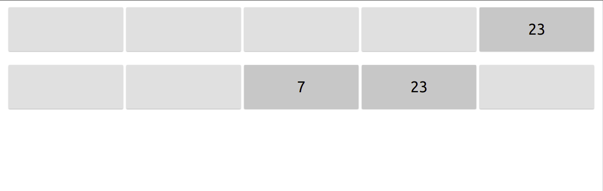

# memory-game

Simple memory game written in React. Used as a practice project.



## Getting Started

### Dependencies

* React.js (v18), TypeScript, Sass, [WindiCSS](https://windicss.org/), [Vite](https://vitejs.dev/)

### Starting

This project uses [PNPM](https://pnpm.io/) and [Node.js](https://nodejs.org) v16.x. Please install them if you don't have them already installed.

* Install dependencies
```
pnpm install
```

* Run dev server
```
pnpm run dev
```

## License

This project is licensed under the MIT License - see the [LICENSE](./LICENSE) file for details
